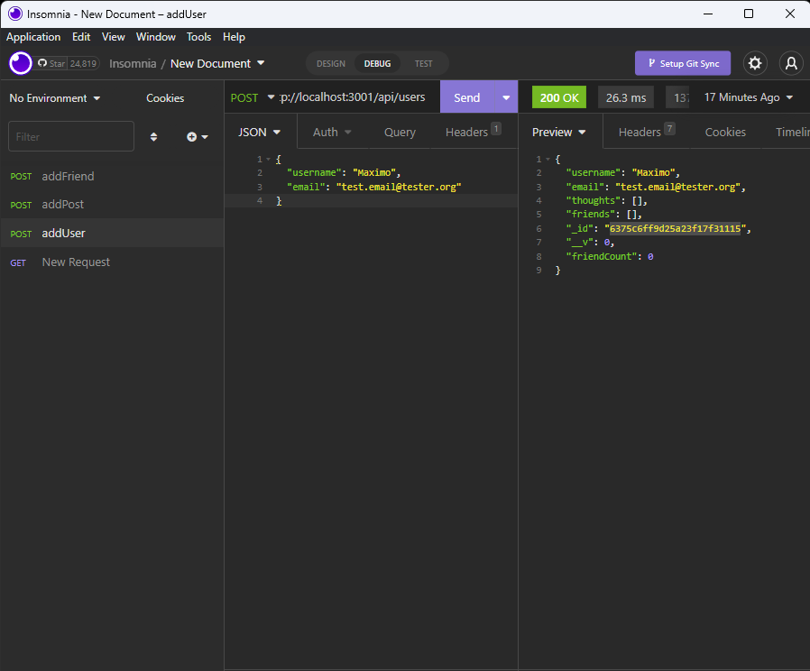

# Maximos-Social-Network-Api
an API for a social network that uses a NoSQL database that a website can use to handle large amounts of unstructured data


## TABLE OF CONTENTS

- [DESCRIPTION](#description)<br>
- [USER STORY](#user-story)<br>
- [INSTALLATION](#installation)<br>
- [TEST](#test)<br>
- [USAGE](#usage)<br>
- [LICENSE](#license)<br>
- [QUESTIONS](#questions)<br>
- [PHOTO](#photo)<br>
- [VIDEO](#video)
  
## DESCRIPTION

A project demonstrating an API that is utilizing MongoDB and Moongoose.

## USER STORY

AS A social media startup
I WANT an API for my social network that uses a NoSQL database
SO THAT my website can handle large amounts of unstructured data

## INSTALLATION

Insomnia and MongoDB is required.
     
## TEST

1. Clone Repo and navigate to root folder of repo using a command-line interface (ex: git bash)
2. Type ``` npm i ``` to install dependencies needed to run this program.

## USAGE
    
Type ``` npm start ``` while in the root directory of this application.

Test routes of this application using Insomnia.


## LICENSE
 
This application is covered under License ISC.<br>
[Click Here to View the License Statement](https://opensource.org/licenses/ISC)<br>

## QUESTIONS

For more applications, please refer to [my GitHub](https://github.com/maximtz13).<br>
For questions, please check usage documentation for reference.<br>
If your question is still unsolved, please send it to *maximtz99@gmail.com* and I will get back to you as soon as possible.

## PHOTO



## VIDEO

[Demo Video](https://drive.google.com/file/d/1v1jNgcYl1uU5QRf_4s8n9SLclAsTGEDW/view?usp=sharing)